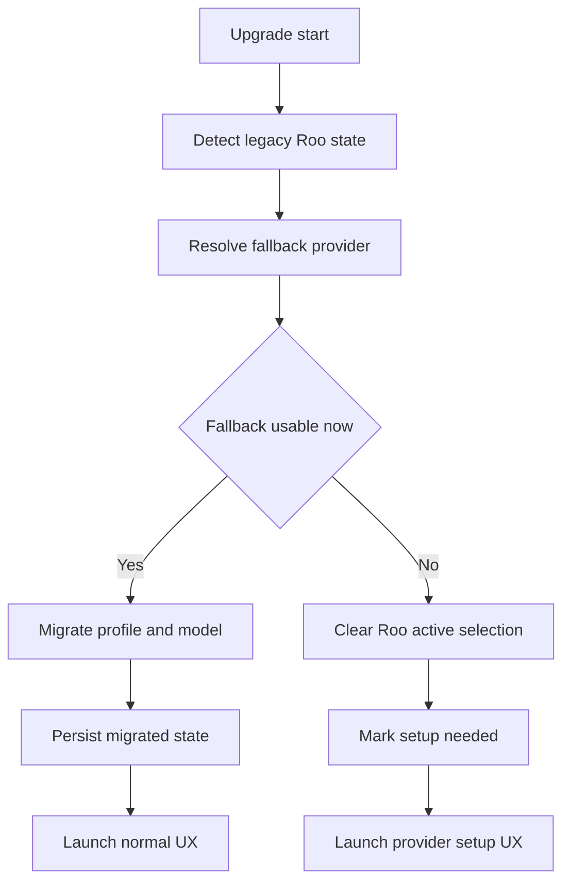

# PRD: Remove Roo Code Router Without Breaking Upgrades

## Executive summary

This PRD defines an upgrade-safe plan to remove the Roo Code Router provider option from the extension, webview, CLI, evals management UI, tests, docs, and migration code while ensuring existing users who currently have `apiProvider: "roo"` or Roo-specific model selections do not land in a broken state after upgrading.

The recommended approach is **not** a hard delete. Instead, it is a staged removal:

1. **Stop exposing Router as a selectable product option** in runtime UI and CLI surfaces.
2. **Temporarily preserve `roo` as a migration-recognized legacy provider identity** long enough to read old state safely and convert it.
3. **Automatically migrate existing Router-selected users to the current login-free default provider path where possible**.
4. **If an automatic usable fallback cannot be completed**, place the user into a guided, non-broken recovery state that opens the normal provider-setup path instead of crashing or surfacing the retired-provider fatal error.
5. **Preserve minimal legacy import compatibility longer than UI/runtime shims** so old exported settings and dormant profiles do not become unrecoverable.

The most important design constraint is that Router removal must be implemented as an **upgrade migration problem**, not merely a UI cleanup problem. The current codebase still has active Roo-specific runtime paths in the extension, onboarding, image generation, CLI provider resolution, evals management UI, model-fetch aggregation, and import/export flows, including [src/api/index.ts](src/api/index.ts:115), [src/core/config/ProviderSettingsManager.ts](src/core/config/ProviderSettingsManager.ts:27), [src/core/config/ContextProxy.ts](src/core/config/ContextProxy.ts:226), [src/core/config/importExport.ts](src/core/config/importExport.ts:40), [src/core/webview/webviewMessageHandler.ts](src/core/webview/webviewMessageHandler.ts:947), [webview-ui/src/components/settings/providers/Roo.tsx](webview-ui/src/components/settings/providers/Roo.tsx:19), [webview-ui/src/components/welcome/WelcomeViewProvider.tsx](webview-ui/src/components/welcome/WelcomeViewProvider.tsx:48), [apps/cli/src/commands/cli/run.ts](apps/cli/src/commands/cli/run.ts:71), and [apps/web-evals/src/app/runs/new/new-run.tsx](apps/web-evals/src/app/runs/new/new-run.tsx:111).

## Problem statement

The repository has already removed Roo Code Cloud in many areas, but Roo Code Router still exists as an active provider option in multiple product and internal surfaces. That leaves the codebase in an inconsistent state:

- Users can still select Router in product settings and onboarding via [webview-ui/src/components/settings/providers/Roo.tsx](webview-ui/src/components/settings/providers/Roo.tsx:19) and [webview-ui/src/components/welcome/WelcomeViewProvider.tsx](webview-ui/src/components/welcome/WelcomeViewProvider.tsx:101).
- The extension still knows how to build a Roo provider handler in [src/api/index.ts](src/api/index.ts:170) and aggregate Roo models in [src/core/webview/webviewMessageHandler.ts](src/core/webview/webviewMessageHandler.ts:967).
- Stored profile state, global state, and imported settings still treat `roo` as a valid provider in [packages/types/src/provider-settings.ts](packages/types/src/provider-settings.ts:126), [src/core/config/ContextProxy.ts](src/core/config/ContextProxy.ts:462), and [src/core/config/ProviderSettingsManager.ts](src/core/config/ProviderSettingsManager.ts:603).
- CLI still supports `roo` as a first-class provider in [apps/cli/src/types/types.ts](apps/cli/src/types/types.ts:4) and has special fallback logic in [apps/cli/src/commands/cli/run.ts](apps/cli/src/commands/cli/run.ts:83).
- Evals management still exposes Roo-backed model selection and job-token concepts in [apps/web-evals/src/app/runs/new/new-run.tsx](apps/web-evals/src/app/runs/new/new-run.tsx:125) and [apps/web-evals/src/hooks/use-roo-provider-models.ts](apps/web-evals/src/hooks/use-roo-provider-models.ts:35).
- Image generation still defaults new users toward Roo in [packages/types/src/image-generation.ts](packages/types/src/image-generation.ts:47) and renders Roo as a selectable image provider in [webview-ui/src/components/settings/ImageGenerationSettings.tsx](webview-ui/src/components/settings/ImageGenerationSettings.tsx:109).

A naïve removal would break several upgrade paths:

- stored extension users with active `apiProvider: "roo"`
- users with saved provider profiles in secrets
- users with mode-to-profile mappings that point at Roo-backed profiles
- imported settings files containing Roo profiles
- CLI users with `provider=roo` or onboarding choice `roo`
- image-generation settings pointing at Roo
- evals management flows that assume Roo-backed model catalogs or tokens

## Goals

1. Remove Roo Code Router as a selectable provider from end-user product surfaces.
2. Preserve a safe upgrade path for users with stored `roo` provider state.
3. Ensure no upgraded user lands on a fatal unsupported-provider error on first launch.
4. Preserve access to old settings/profile data long enough to migrate or recover it.
5. Convert stored state to the current login-free default provider path when a usable fallback is possible.
6. Route users without a usable automatic fallback into a guided setup state rather than a broken runtime state.
7. Remove Router-specific docs, tests, and internal/admin UI references that are no longer needed.
8. Keep [apps/web-roo-code](apps/web-roo-code) out of implementation scope unless later explicitly requested.

## Non-goals

1. Do not redesign provider onboarding beyond what is necessary to remove Router.
2. Do not change public website marketing or navigation under [apps/web-roo-code](apps/web-roo-code) in this workstream.
3. Do not build a new hosted provider replacement.
4. Do not attempt to preserve full Router feature parity under another provider.
5. Do not migrate evals execution architecture outside the specific Roo references needed to stop exposing Router.

## Scope note

### In scope

- extension runtime and provider resolution
- webview settings and onboarding
- stored profile and global-state migrations
- import/export compatibility
- CLI provider resolution and onboarding cleanup
- evals management UI cleanup under [apps/web-evals](apps/web-evals)
- tests, changelog, and documentation updates in this repository

### Explicitly out of scope

Implementation must **not** change the public website app under [apps/web-roo-code](apps/web-roo-code) unless later requested. This includes existing website references such as [apps/web-roo-code/src/components/chromes/nav-bar.tsx](apps/web-roo-code/src/components/chromes/nav-bar.tsx:104) and the public evals page at [apps/web-roo-code/src/app/evals/evals.tsx](apps/web-roo-code/src/app/evals/evals.tsx:36). Those references may be mentioned in this PRD for inventory purposes, but later implementation should treat them as excluded.

## Current-state inventory of Router-related code paths by subsystem

### 1. Active product runtime and provider plumbing

#### Extension provider construction

- [src/api/index.ts](src/api/index.ts:115) rejects retired providers but still treats `roo` as active and instantiates `RooHandler` in [src/api/index.ts](src/api/index.ts:170).
- This means `roo` cannot simply disappear from type definitions without first adding a migration-safe path.

#### Extension model aggregation

- [src/core/webview/webviewMessageHandler.ts](src/core/webview/webviewMessageHandler.ts:947) includes Roo in aggregate router model fetching.
- Removing Router requires updating the shared router-model fetcher so it no longer requests Roo models.

#### Extension state refresh behavior

- [webview-ui/src/context/ExtensionStateContext.tsx](webview-ui/src/context/ExtensionStateContext.tsx:477) refreshes Roo models after auth if Roo is the active provider.
- This effect becomes dead code once Roo is removed from runtime selection.

#### Product settings UI

- [webview-ui/src/components/settings/providers/Roo.tsx](webview-ui/src/components/settings/providers/Roo.tsx:19) renders the dedicated Roo settings section.
- It binds to `routerModels?.roo` and uses `rooDefaultModelId`, making it an active product option rather than legacy-only code.

#### Welcome and onboarding UI

- [webview-ui/src/components/welcome/WelcomeViewProvider.tsx](webview-ui/src/components/welcome/WelcomeViewProvider.tsx:26) models onboarding as `roo | custom`.
- It writes `apiProvider: "roo"` in [webview-ui/src/components/welcome/WelcomeViewProvider.tsx](webview-ui/src/components/welcome/WelcomeViewProvider.tsx:62) and [webview-ui/src/components/welcome/WelcomeViewProvider.tsx](webview-ui/src/components/welcome/WelcomeViewProvider.tsx:104).
- It triggers Router sign-in in [webview-ui/src/components/welcome/WelcomeViewProvider.tsx](webview-ui/src/components/welcome/WelcomeViewProvider.tsx:115).

### 2. Stored config, profile, and migration code

#### Provider schema and validity

- `roo` is currently an active provider name in [packages/types/src/provider-settings.ts](packages/types/src/provider-settings.ts:126).
- `roo` is **not** currently listed as retired in [packages/types/src/provider-settings.ts](packages/types/src/provider-settings.ts:144).
- This distinction matters because sanitizers preserve retired providers but strip unknown ones.

#### Global-state sanitization

- [src/core/config/ContextProxy.ts](src/core/config/ContextProxy.ts:226) preserves active and retired providers, but clears unknown ones.
- [src/core/config/ContextProxy.ts](src/core/config/ContextProxy.ts:448) performs the same sanitization when parsing provider settings.
- If `roo` is removed from active types without a transitional compatibility shim, legacy state risks being stripped before migration can map it.

#### Secret-stored provider profiles

- [src/core/config/ProviderSettingsManager.ts](src/core/config/ProviderSettingsManager.ts:580) loads all provider profiles from secrets.
- [src/core/config/ProviderSettingsManager.ts](src/core/config/ProviderSettingsManager.ts:643) sanitizes unknown providers out of saved profiles.
- [src/core/config/ProviderSettingsManager.ts](src/core/config/ProviderSettingsManager.ts:519) preserves retired-provider profiles during export.
- [src/core/config/ProviderSettingsManager.ts](src/core/config/ProviderSettingsManager.ts:27) currently contains Roo-specific model migrations.

#### Import and export

- [src/core/config/importExport.ts](src/core/config/importExport.ts:40) currently removes any imported provider that is not an active provider.
- Because it only checks `isProviderName` in [src/core/config/importExport.ts](src/core/config/importExport.ts:52), imported Roo profiles would become invalid immediately once `roo` is removed from active providers unless a dedicated compatibility exception is added.
- [src/core/config/importExport.ts](src/core/config/importExport.ts:163) imports provider profiles before pushing the chosen provider into global state.

#### Existence checks

- [src/shared/checkExistApiConfig.ts](src/shared/checkExistApiConfig.ts:8) treats `roo` as needing no configuration.
- That special case becomes wrong after Router removal and must be updated.

### 3. Image generation

- [packages/types/src/image-generation.ts](packages/types/src/image-generation.ts:44) limits image-generation providers to `openrouter | roo`.
- [packages/types/src/image-generation.ts](packages/types/src/image-generation.ts:47) defaults new users to `roo` when no explicit provider exists.
- [webview-ui/src/components/settings/ImageGenerationSettings.tsx](webview-ui/src/components/settings/ImageGenerationSettings.tsx:109) renders Roo as an image-generation provider option.
- [src/core/tools/GenerateImageTool.ts](src/core/tools/GenerateImageTool.ts:193) still invokes `RooHandler` for image generation.
- This is a separate but related migration surface because users can be broken even if chat provider migration succeeds.

### 4. CLI runtime, onboarding, and settings

#### Supported provider set

- [apps/cli/src/types/types.ts](apps/cli/src/types/types.ts:4) includes `roo` in `supportedProviders`.
- [apps/cli/src/types/types.ts](apps/cli/src/types/types.ts:46) includes onboarding choice `Roo`.

#### Provider fallback behavior

- [apps/cli/src/commands/cli/run.ts](apps/cli/src/commands/cli/run.ts:71) resolves stored Roo preferences to `DEFAULT_PROVIDER` when Roo credentials are missing.
- [apps/cli/src/commands/cli/run.ts](apps/cli/src/commands/cli/run.ts:223) logs fallback from stored Roo preference.
- [apps/cli/src/commands/cli/run.ts](apps/cli/src/commands/cli/run.ts:313) contains token-validation logic only for Roo.
- [apps/cli/src/commands/cli/run.ts](apps/cli/src/commands/cli/run.ts:355) resolves Roo API key differently from other providers.
- [apps/cli/src/commands/cli/run.ts](apps/cli/src/commands/cli/run.ts:95) warms Roo models.

#### Provider settings mapping

- [apps/cli/src/lib/utils/provider.ts](apps/cli/src/lib/utils/provider.ts:23) knows how to write Roo settings.

#### CLI docs

- [apps/cli/README.md](apps/cli/README.md:133) documents optional Roo auth.
- [apps/cli/README.md](apps/cli/README.md:193) documents `roo` as a provider option and `openrouter` as the default.
- [apps/cli/README.md](apps/cli/README.md:217) documents `ROO_API_KEY`.

### 5. Evals management UI and evals-related admin flows

Per the evals skill context, this is **internal evals execution and management UI**, not the public website page.

#### New-run form

- [apps/web-evals/src/app/runs/new/new-run.tsx](apps/web-evals/src/app/runs/new/new-run.tsx:111) models the provider source as `roo | openrouter | other`.
- [apps/web-evals/src/app/runs/new/new-run.tsx](apps/web-evals/src/app/runs/new/new-run.tsx:125) fetches Roo catalog models via `useRooProviderModels`.
- [apps/web-evals/src/app/runs/new/new-run.tsx](apps/web-evals/src/app/runs/new/new-run.tsx:277) preserves Roo last-used model selection.
- [apps/web-evals/src/app/runs/new/new-run.tsx](apps/web-evals/src/app/runs/new/new-run.tsx:420) requires a Roo token.
- [apps/web-evals/src/app/runs/new/new-run.tsx](apps/web-evals/src/app/runs/new/new-run.tsx:777) renders a Roo Provider Token field.

#### Roo model catalog hook

- [apps/web-evals/src/hooks/use-roo-provider-models.ts](apps/web-evals/src/hooks/use-roo-provider-models.ts:35) fetches a Roo-hosted model catalog from `NEXT_PUBLIC_ROO_EVALS_MODEL_CATALOG_URL`.

#### Evals docs

- [packages/evals/README.md](packages/evals/README.md:9) already skews toward OpenRouter setup, which is a useful signal that evals can likely shed Roo support without touching public website code.

### 6. Documentation, changelog, translations, and historical references

- [CHANGELOG.md](CHANGELOG.md:347) documents the rename from Roo Code Cloud to Roo Code Router.
- [CHANGELOG.md](CHANGELOG.md:1469) documents Router-selection fixes.
- [apps/cli/CHANGELOG.md](apps/cli/CHANGELOG.md:278) still mentions Roo Code Router auth validation.
- Welcome translations still market Router in locale files such as [webview-ui/src/i18n/locales/de/welcome.json](webview-ui/src/i18n/locales/de/welcome.json:22) and [webview-ui/src/i18n/locales/zh-TW/welcome.json](webview-ui/src/i18n/locales/zh-TW/welcome.json:22).
- The public website app also still references Router, but implementation should not touch [apps/web-roo-code](apps/web-roo-code).

### 7. Tests that encode Roo behavior

Representative examples:

- [src/core/config/**tests**/ProviderSettingsManager.spec.ts](src/core/config/__tests__/ProviderSettingsManager.spec.ts:227) validates Roo model migration behavior.
- [src/shared/**tests**/checkExistApiConfig.spec.ts](src/shared/__tests__/checkExistApiConfig.spec.ts:83) expects Roo to count as configured without a key.
- [webview-ui/src/components/welcome/**tests**/WelcomeViewProvider.spec.tsx](webview-ui/src/components/welcome/__tests__/WelcomeViewProvider.spec.tsx:198) expects Roo and custom radio buttons.
- [webview-ui/src/components/welcome/**tests**/WelcomeViewProvider.spec.tsx](webview-ui/src/components/welcome/__tests__/WelcomeViewProvider.spec.tsx:249) expects onboarding to write `apiProvider: "roo"`.
- [webview-ui/src/components/settings/**tests**/ImageGenerationSettings.spec.tsx](webview-ui/src/components/settings/__tests__/ImageGenerationSettings.spec.tsx:93) expects Roo image-generation provider behavior.
- [apps/cli/src/commands/cli/**tests**/run-provider-resolution.test.ts](apps/cli/src/commands/cli/__tests__/run-provider-resolution.test.ts:4) encodes CLI fallback semantics around Roo.
- [apps/web-evals/src/hooks/use-roo-provider-models.test.ts](apps/web-evals/src/hooks/use-roo-provider-models.test.ts:28) exercises Roo eval-catalog fetching.

## Key product and migration constraints

1. **No first-launch breakage after upgrade**.
2. **No fatal unsupported-provider path for users who were valid before upgrade**.
3. **No silent data loss of stored profiles before migration runs**.
4. **No implicit website scope creep into [apps/web-roo-code](apps/web-roo-code)**.
5. **Importer compatibility matters** because old exported settings files may continue to circulate after the removal release.
6. **Image generation must be migrated separately** because it has independent Roo defaults and runtime code.

## Recommended backward-compatibility strategy

### Summary

Use a **two-layer compatibility strategy**:

1. **Transitional recognition layer**

    - Treat `roo` as a **legacy-recognized provider** for loading, import, and migration.
    - Do **not** expose it in user-selectable UI or CLI options.

2. **Automatic fallback layer**
    - When legacy Roo state is detected, automatically migrate to the current login-free default provider path **if that path is immediately usable**.
    - If it is **not** immediately usable, move the user into a guided setup state with no Roo selection left active.

### Why this strategy is preferred

A hard removal would let sanitizers in [src/core/config/ContextProxy.ts](src/core/config/ContextProxy.ts:230), [src/core/config/ProviderSettingsManager.ts](src/core/config/ProviderSettingsManager.ts:643), and [src/core/config/importExport.ts](src/core/config/importExport.ts:44) erase Roo identity before the app can decide how to recover. That risks users ending up with partially valid profiles, stale model fields, or empty provider state without UX guidance.

A transitional retired/legacy state keeps enough information alive to:

- know the user had Router selected
- preserve legacy model IDs long enough to attempt mapping
- preserve profile names and mode bindings
- decide whether fallback is fully automatic or setup-assisted

## Proposed fallback behavior when Router is detected on upgrade

### Primary rule

When upgrading and Router is detected as the active provider or active profile:

1. Attempt to migrate the user to the **current login-free default provider path**.
2. If that fallback provider already has sufficient credentials or login-free readiness in the current surface, activate it automatically.
3. If no immediately usable fallback exists, clear Roo as the active provider and route the user to the standard provider-setup flow in a controlled state.

### Recommended fallback target

- **CLI**: use its existing `DEFAULT_PROVIDER` semantics, which current docs indicate as `openrouter` in [apps/cli/README.md](apps/cli/README.md:193).
- **Extension and webview**: use a single shared fallback resolver that points to the product’s current non-Router default onboarding path, rather than hard-coding Roo removal logic in multiple UI components.

### User-visible behavior

#### Case A: fallback is immediately usable

Example: a user has Router selected, but also already has valid default-provider credentials saved.

Behavior:

- migrate active profile away from Roo
- map any compatible model fields
- preserve profile name where possible
- show a one-time informational note that Router was removed and the profile was migrated
- continue into normal chat/settings flow without interruption

#### Case B: fallback provider exists conceptually but is not usable yet

Example: a user only had Router and no compatible BYOK credentials.

Behavior:

- do **not** keep `apiProvider: "roo"` active
- do **not** let provider construction reach the fatal unsupported-provider path
- activate a setup-needed fallback profile or provider-selection state
- open the normal welcome/settings provider-setup experience
- preserve legacy Roo data in a backup form long enough to support recovery and support diagnostics

This satisfies the user requirement of “must not end up broken” while still honoring automatic fallback as the primary strategy.

## Detailed migration plan for stored config, profile, and model state

### Migration principles

1. Migrate before sanitizers discard Roo identity.
2. Separate **profile migration** from **active-state migration**.
3. Preserve enough metadata to support rollback, support, and import compatibility.
4. Make migrations **idempotent** so repeated startup/import cycles do not corrupt state.

### Migration data surfaces

#### A. Secret-stored provider profiles

Source: [src/core/config/ProviderSettingsManager.ts](src/core/config/ProviderSettingsManager.ts:580)

Needs migration for:

- `apiProvider: "roo"`
- Roo model fields such as `apiModelId`
- active profile name and `modeApiConfigs`
- any Roo-specific secrets such as `rooApiKey`

Recommended behavior:

- keep loading Roo as legacy-recognized during the migration release
- add a dedicated `routerRemovedMigrated` migration flag in provider-profile migrations
- for each Roo profile:
    - determine fallback provider
    - create migrated profile content for fallback provider
    - preserve old Roo values in a `legacyRooBackup` object or equivalent migration-only metadata until cleanup window ends
    - clear active Roo-only fields from the new runtime profile
- if profile cannot become immediately usable, keep the profile record but mark it as setup-needed under the fallback provider or a provider-unset state

#### B. Global provider state in ContextProxy

Source: [src/core/config/ContextProxy.ts](src/core/config/ContextProxy.ts:421)

Needs migration for:

- active `apiProvider`
- active model fields
- image-generation provider defaults
- current profile metadata mirrored into global state

Recommended behavior:

- add an early startup migration that runs before generic invalid-provider sanitization
- if global `apiProvider === "roo"`, resolve replacement provider and write migrated values
- if no usable fallback exists, clear active provider and set a one-shot `needsProviderSetupAfterRouterRemoval` flag consumed by onboarding/settings UX

#### C. Import/export payloads

Source: [src/core/config/importExport.ts](src/core/config/importExport.ts:40)

Current risk:

- imported Roo profiles will lose `apiProvider` as soon as Roo is no longer an active provider, because `sanitizeProviderConfig` only preserves active providers.

Recommended behavior:

- extend import sanitization to recognize legacy Roo and route it through the same migration resolver used at startup
- produce warnings such as:
    - Router was removed
    - imported profile was migrated to fallback provider
    - imported profile requires provider setup to become usable
- preserve import success when possible rather than outright rejecting files containing Roo

#### D. CLI persisted settings

Sources: [apps/cli/src/types/types.ts](apps/cli/src/types/types.ts:57) and [apps/cli/src/commands/cli/run.ts](apps/cli/src/commands/cli/run.ts:71)

Needs migration for:

- `settings.provider === "roo"`
- `onboardingProviderChoice === Roo`
- stored Roo auth token references

Recommended behavior:

- treat stored `provider=roo` as a legacy preference
- reuse existing fallback pattern in [apps/cli/src/commands/cli/run.ts](apps/cli/src/commands/cli/run.ts:83), but after removal make it unconditional for stored settings, not conditional on credential presence
- remove Roo from supported explicit providers once migration messaging exists
- retain one release of CLI warning text explaining the automatic migration

#### E. Image generation state

Source: [packages/types/src/image-generation.ts](packages/types/src/image-generation.ts:47)

Needs migration for:

- `imageGenerationProvider === "roo"`
- Roo image-generation models
- Roo-default behavior for new users

Recommended behavior:

- migrate existing Roo image-generation provider to `openrouter` if a compatible image model can be mapped and OpenRouter key already exists
- otherwise migrate to `openrouter` with setup-needed status and no broken runtime call path
- change new-user default away from Roo immediately in the same release

### Model-state migration strategy

#### Chat/provider model selections

Current Roo-specific model migration exists only for `roo/code-supernova` in [src/core/config/ProviderSettingsManager.ts](src/core/config/ProviderSettingsManager.ts:27) and is insufficient for provider removal.

Recommended approach:

1. Add a Router-removal model migration map that attempts to translate known Roo model IDs to default-provider equivalents when a safe match exists.
2. If no exact model mapping exists:
    - set the fallback provider’s default model
    - store previous Roo model ID as legacy metadata for diagnostics
    - emit a one-time user-facing notice
3. Ensure per-mode profile bindings remain valid after profile migration.

#### Evals model selections

- Roo-only last-model selection in [apps/web-evals/src/app/runs/new/new-run.tsx](apps/web-evals/src/app/runs/new/new-run.tsx:277) should be removed or replaced with fallback-provider storage.
- Internal eval runs that still depend on Roo token flow should be explicitly called out as requiring separate admin migration before Roo references are deleted.

## Proposed implementation design

### Core design decision

Introduce a **central Router removal migration resolver** used by all affected surfaces:

- extension startup migration
- provider profile load/import migration
- CLI settings migration
- image-generation migration

This resolver should answer:

- was Router detected
- what fallback provider should be used here
- can migration complete automatically
- what fields are preserved, mapped, cleared, or marked for user action

### Suggested migration flow

## Detailed implementation plan and workstreams

### Workstream 1: Transitional type and schema support

**Goal:** allow old Roo state to be read safely while making Roo non-selectable.

Tasks:

1. Reclassify Roo from active-provider runtime usage to legacy-recognized migration usage.
2. Decide whether Roo should temporarily move into retired-provider handling or a dedicated legacy alias path.
3. Update provider schema helpers so Roo is preserved during migration but excluded from new selection surfaces.
4. Add a migration flag for Router removal in provider-profile storage.
5. Audit any type unions that must stop advertising Roo to new runtime callers.

Key files:

- [packages/types/src/provider-settings.ts](packages/types/src/provider-settings.ts:126)
- [src/core/config/ContextProxy.ts](src/core/config/ContextProxy.ts:226)
- [src/core/config/ProviderSettingsManager.ts](src/core/config/ProviderSettingsManager.ts:643)

### Workstream 2: Extension startup and stored-profile migration

**Goal:** prevent broken first-launch behavior in the extension.

Tasks:

1. Add a Router-removal migration step before generic invalid-provider sanitization.
2. Migrate secret-stored profiles with `apiProvider: "roo"` to fallback provider profiles.
3. Preserve `modeApiConfigs` and active profile linkage after migration.
4. Migrate global-state mirror values in `ContextProxy`.
5. Add one-shot UX flags for setup-needed recovery.
6. Ensure no code path reaches Roo runtime provider construction after migration completes.

Key files:

- [src/core/config/ProviderSettingsManager.ts](src/core/config/ProviderSettingsManager.ts:102)
- [src/core/config/ContextProxy.ts](src/core/config/ContextProxy.ts:421)
- [src/api/index.ts](src/api/index.ts:170)

### Workstream 3: Webview settings and onboarding removal

**Goal:** stop offering Router in user-facing UI while keeping upgraded users recoverable.

Tasks:

1. Remove the Roo provider card from welcome onboarding.
2. Remove Roo provider-specific settings panel from settings UI.
3. Update any auth-trigger side effects that refresh Roo models.
4. Replace upgrade-time Roo recovery with either:
    - migrated fallback profile activation, or
    - standard provider-setup entry point
5. Remove Roo-specific welcome translations from locale bundles.
6. Update tests that currently expect Roo onboarding flows.

Key files:

- [webview-ui/src/components/welcome/WelcomeViewProvider.tsx](webview-ui/src/components/welcome/WelcomeViewProvider.tsx:101)
- [webview-ui/src/components/settings/providers/Roo.tsx](webview-ui/src/components/settings/providers/Roo.tsx:19)
- [webview-ui/src/context/ExtensionStateContext.tsx](webview-ui/src/context/ExtensionStateContext.tsx:477)
- [webview-ui/src/components/welcome/**tests**/WelcomeViewProvider.spec.tsx](webview-ui/src/components/welcome/__tests__/WelcomeViewProvider.spec.tsx:198)

### Workstream 4: Router-model fetch and provider-runtime cleanup

**Goal:** remove active Roo fetch and handler paths after migration support exists.

Tasks:

1. Remove Roo from aggregate router-model fetching.
2. Remove Roo handler construction from runtime provider switch after migration safety is in place.
3. Remove Roo-specific warmup and auth-refresh messaging.
4. Remove Roo-specific existence-check shortcuts.
5. Verify no latent callsites still assume `routerModels.roo` exists.

Key files:

- [src/core/webview/webviewMessageHandler.ts](src/core/webview/webviewMessageHandler.ts:947)
- [src/api/index.ts](src/api/index.ts:121)
- [src/shared/checkExistApiConfig.ts](src/shared/checkExistApiConfig.ts:8)

### Workstream 5: Image-generation migration

**Goal:** prevent Roo image-generation configuration from becoming a hidden breakage path.

Tasks:

1. Remove Roo from image-generation provider options.
2. Change new-user image-generation default away from Roo.
3. Migrate existing `imageGenerationProvider=roo` state to the fallback image provider.
4. Remove Roo image-generation runtime invocation.
5. Update image-generation strings and tests.

Key files:

- [packages/types/src/image-generation.ts](packages/types/src/image-generation.ts:44)
- [webview-ui/src/components/settings/ImageGenerationSettings.tsx](webview-ui/src/components/settings/ImageGenerationSettings.tsx:109)
- [src/core/tools/GenerateImageTool.ts](src/core/tools/GenerateImageTool.ts:193)

### Workstream 6: CLI removal and CLI upgrade safety

**Goal:** keep CLI users from breaking on stored Roo preferences while removing Roo as a supported option.

Tasks:

1. Remove Roo from `supportedProviders` after migration messaging is ready.
2. Convert stored `provider=roo` to CLI `DEFAULT_PROVIDER` semantics.
3. Convert `onboardingProviderChoice=Roo` to the non-Router onboarding path.
4. Remove Roo token validation, Roo model warmup, and Roo-specific API key resolution.
5. Remove Roo auth docs and environment-variable docs.
6. Keep one migration-release warning message for users who had Roo configured.

Key files:

- [apps/cli/src/types/types.ts](apps/cli/src/types/types.ts:4)
- [apps/cli/src/commands/cli/run.ts](apps/cli/src/commands/cli/run.ts:71)
- [apps/cli/src/lib/utils/provider.ts](apps/cli/src/lib/utils/provider.ts:23)
- [apps/cli/README.md](apps/cli/README.md:133)

### Workstream 7: Evals management UI cleanup

**Goal:** remove Roo option from internal eval-run configuration unless separately required for internal-only admin migration.

Tasks:

1. Remove Roo as a model source in the new-run form.
2. Remove Roo token field and Roo-only local-storage persistence.
3. Remove Roo catalog hook if no longer needed.
4. Confirm evals execution setup remains OpenRouter-capable.
5. Preserve explicit website out-of-scope boundary with [apps/web-roo-code](apps/web-roo-code).

Key files:

- [apps/web-evals/src/app/runs/new/new-run.tsx](apps/web-evals/src/app/runs/new/new-run.tsx:111)
- [apps/web-evals/src/hooks/use-roo-provider-models.ts](apps/web-evals/src/hooks/use-roo-provider-models.ts:35)
- [packages/evals/README.md](packages/evals/README.md:9)

### Workstream 8: Docs, changelog, and localization cleanup

**Goal:** remove active-user guidance that still points to Router.

Tasks:

1. Update extension welcome and settings copy.
2. Update CLI README and auth help text.
3. Add changelog entry describing Router removal and upgrade migration behavior.
4. Remove or rewrite locale keys that mention Roo Code Router.
5. Leave historical changelog entries intact except where the current release needs clarification.

Key files:

- [CHANGELOG.md](CHANGELOG.md:347)
- [apps/cli/README.md](apps/cli/README.md:133)
- [webview-ui/src/i18n/locales/de/welcome.json](webview-ui/src/i18n/locales/de/welcome.json:22)

### Workstream 9: Test suite conversion

**Goal:** replace Roo-positive assertions with migration and recovery assertions.

Tasks:

1. Replace tests that assert Roo remains selectable.
2. Add tests for startup migration from active Roo state.
3. Add tests for import/export migration of Roo profiles.
4. Add tests for profile backup and idempotent re-run behavior.
5. Add tests for CLI stored Roo preference fallback after removal.
6. Add tests for image-generation migration.
7. Add tests for evals admin UI cleanup if kept in scope.

## Risks, edge cases, and mitigations

| Risk                                                       | Example                                                        | Mitigation                                                                                                                |
| ---------------------------------------------------------- | -------------------------------------------------------------- | ------------------------------------------------------------------------------------------------------------------------- |
| Roo becomes unknown too early                              | Sanitizer strips `apiProvider: roo` before migration           | Run Router-removal migration before invalid-provider sanitization and preserve Roo as legacy-recognized during transition |
| User has only Roo and no fallback credentials              | Automatic fallback points to a provider that still needs setup | Convert to setup-needed state and launch standard provider setup UX instead of leaving Roo active                         |
| Mode bindings point at migrated/deleted profile IDs        | `modeApiConfigs` references stale IDs                          | Migrate profile IDs carefully or update all bound IDs in the same transaction                                             |
| Import of old settings file silently loses Roo intent      | Import sanitization removes `apiProvider`                      | Route imported Roo configs through same legacy migration resolver and return warnings                                     |
| Image generation remains on Roo after chat migration       | Hidden runtime failure in image tool                           | Include image-generation migration in the same release                                                                    |
| CLI users lose ability to run due to stored Roo preference | `provider=roo` no longer supported                             | Reuse existing fallback pattern and migrate stored settings before validation                                             |
| Evals internal users still require Roo admin flow          | New-run form removal blocks internal process                   | Confirm internal dependency first; if unavoidable, isolate as internal-only exception rather than product feature         |
| Historical profile data is lost                            | Old model IDs and Roo credentials discarded immediately        | Preserve backup metadata or legacy import shim for a defined grace period                                                 |

## Test plan and validation matrix

### Validation principles

- test migrations from real legacy Roo state, not only clean-state behavior
- test both usable and unusable fallback scenarios
- test idempotency across repeated launches/imports
- test product, CLI, and admin evals surfaces separately

### Validation matrix

| Scenario                                                           | Surface           | Expected result                                                              |
| ------------------------------------------------------------------ | ----------------- | ---------------------------------------------------------------------------- |
| Existing active Roo provider with usable fallback credentials      | Extension         | User launches successfully on migrated fallback profile                      |
| Existing active Roo provider with no fallback credentials          | Extension         | User lands in provider setup state, no fatal provider error                  |
| Saved Roo profile not currently active                             | Extension         | Profile is migrated or marked setup-needed without corrupting other profiles |
| Mode-specific config points to Roo profile                         | Extension         | Mode binding points to migrated replacement profile                          |
| Old exported settings file contains Roo profile                    | Import/export     | Import succeeds with warnings and migrated result                            |
| Global state contains `apiProvider=roo` but profiles are absent    | Extension         | Global state is repaired and user is routed to safe setup path               |
| Image generation provider is Roo                                   | Extension         | Migrated to non-Roo image provider or setup-needed state                     |
| CLI settings file has `provider=roo`                               | CLI               | Command runs through default-provider fallback or instructive setup path     |
| CLI onboarding choice is Roo                                       | CLI               | Onboarding no longer attempts Roo path                                       |
| User explicitly passes `--provider roo` during deprecation release | CLI               | Clear migration/removal error message with recovery guidance                 |
| Evals new-run form previously stored Roo selections                | Web-evals         | Form no longer exposes Roo and does not crash on stale local storage         |
| Fresh install after removal                                        | Extension and CLI | No Roo UI, no Roo defaults, no Roo docs shown                                |

### Required automated test areas

#### Extension and config tests

- startup migration from Roo active provider
- provider-profile migration in secrets
- import of Roo profiles from JSON
- idempotent rerun of migration
- per-mode profile remapping
- unsupported-provider guard never triggered for migrated users

#### Webview tests

- welcome screen no longer renders Roo option
- settings no longer renders Roo provider panel
- setup-needed upgrade flow opens correct non-Router path
- image-generation settings no longer offer Roo

#### CLI tests

- stored Roo preference migration
- onboarding migration
- explicit Roo provider rejection after removal release gates are active
- README and help snapshots if applicable

#### Evals tests

- Roo provider source removed from new-run UI
- stale Roo local-storage state does not break rendering
- Roo model catalog hook removed or isolated

## Rollout plan

### Phase 1: Compatibility-first removal release

- keep legacy Roo recognition for migration
- remove Roo from selection UIs
- migrate startup/import/CLI/image state
- ship migration messaging and validation coverage

### Phase 2: Cleanup release

- remove heavier runtime shims no longer needed after successful migration window
- keep minimal legacy import recognition if still needed
- remove obsolete tests and dead utility code

### Phase 3: Long-tail cleanup

- evaluate whether any legacy Roo import support can be deleted
- only remove remaining compatibility aliases after evidence that old exported configs are no longer expected to work

## Recommendation on temporary shims and deletion timing

### Recommendation

**Preserve temporary migration shims, but split them into short-lived and long-lived categories.**

#### Keep short-lived shims temporarily

Keep for the migration release and at least one follow-up stable release:

- startup migration logic for active Roo users
- setup-needed recovery flags
- one-time user messaging
- CLI stored-setting migration warnings

These are safe to delete once:

- no supported upgrade path needs them
- tests confirm post-migration state no longer contains Roo
- support confirms no recurring reports from users upgrading from pre-removal versions

#### Keep minimal long-lived shims longer

Keep longer, possibly indefinitely unless product policy explicitly drops old-import support:

- import-time recognition of legacy Roo profiles
- profile-loader recognition that prevents silent loss of old exported settings

Rationale:

Import compatibility is a different promise from runtime support. Removing runtime Router quickly is reasonable. Making old settings files unrecoverable is a worse long-tail regression.

### Deletion rule of thumb

- delete **runtime/UI shims** after the migration window proves stable
- keep **import and legacy-profile parsing shims** until the team explicitly decides old config files no longer need to import cleanly

## Ready for implementation

### Recommended execution order

1. Add legacy-recognized Roo migration support in types and config loaders.
2. Implement startup/profile/import migration resolver.
3. Implement extension/webview fallback UX and remove Router UI.
4. Migrate image-generation Roo defaults and runtime.
5. Remove Roo from CLI supported providers and docs while preserving stored-setting migration.
6. Remove Roo from evals management UI.
7. Update docs, locales, changelog, and tests.
8. Run full validation matrix across upgrade scenarios.

### Handoff summary for Code mode

Code mode should treat this as a **migration-led provider removal** across:

- extension runtime
- webview onboarding and settings
- secret-stored profiles
- global provider state
- import/export
- image generation
- CLI provider resolution
- evals management UI

The implementation should explicitly avoid changing [apps/web-roo-code](apps/web-roo-code) unless later requested.
